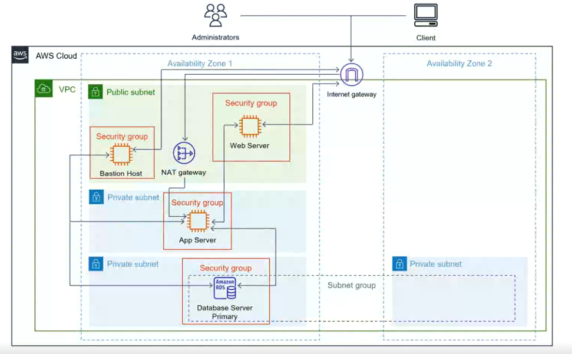

# AWS 3-Tier High Availability Architecture
##  This Terraform project provisions a full 3-tier architecture on AWS, including:
- Custom VPC
- 1 public subnet and 3 private subnets across multiple Availability Zones
- Internet Gateway and NAT Gateway
- Bastion Host in the public subnet
- Web Server (Apache + PHP) in the public subnet
- App Server (MariaDB client) in a private subnet
- RDS (MariaDB) in private subnets
- Security groups for controlled access between layers

## Architecture Diagram

## Prerequisites
- [Terraform](https://www.terraform.io/downloads) installed
- AWS CLI configured (`aws configure`)
- A valid EC2 key pair created in the AWS Console

## Project Structure
- 3tier-aws-terraform/
- main.tf         # All Terraform infrastructure
-  variables.tf    # Input variables
-  outputs.tf      # Output values
- .gitignore      # Ignore Terraform cache and state
- README.md       # This file

## Usage
1. Clone the repository
  - git clone https://github.com/Copubah/AWS-3-tier-high-availability-architecture
  - cd AWS-3-tier-high-availability-architecture

2. Initialize Terraform
  - terraform init

3. Apply the configuration
- Replace your-key-name with the name of your existing EC2 key pair:
- terraform apply -var="key_name=your-key-name"
Terraform will show the resources to be created. Type yes to confirm.

## Outputs
- After a successful apply, Terraform will display:
- Bastion Host public IP
- Web Server public IP
- App Server private IP
- RDS database endpoint
- Use these to SSH into your Bastion and connect to your internal resources.

 ## Connect to Private Servers
- SSH into the Bastion Host:
  - ssh -i your-key.pem ec2-user@<bastion-public-ip>

- From Bastion, connect to App Server or Database:
  - ssh -i your-key.pem ec2-user@<app-private-ip>

## Clean Up
- To delete all created resources:
  - terraform destroy -var="key_name=your-key-name"

## License

MIT

